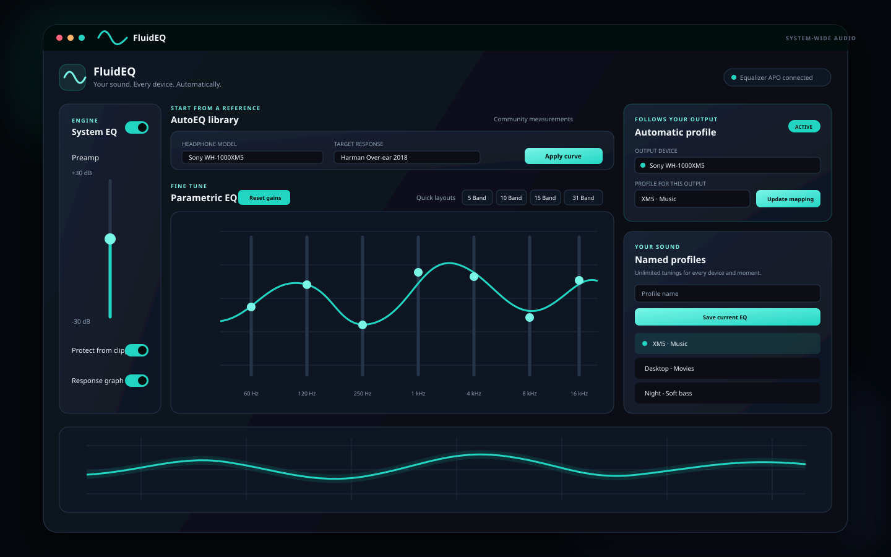

# FluidEQ

> Your sound. Every device. Automatically.

FluidEQ is a free, open-source system-wide parametric equalizer for Windows. It
adds a modern workflow on top of [Equalizer APO](https://sourceforge.net/projects/equalizerapo/): create as many named EQ profiles as you need, attach a profile to an audio output, and let FluidEQ keep the right sound with the right device.



## Why FluidEQ

- **Unlimited named profiles** — keep separate tunings for music, movies,
  gaming, night listening, speakers, headphones, and more.
- **Automatic device profiles** — assign an EQ to a stable Windows audio
  endpoint ID. Selecting that output applies its profile automatically.
- **Up to 128 parametric filters** — low shelf, peak, and high shelf filters
  with frequency, gain, and Q controls.
- **AutoEQ built in** — start from community headphone measurements and target
  curves, then make the sound your own.
- **Current AutoEQ database** - checks the official source in the background
  and installs compact, validated database updates only when you choose.
- **Safer gain management** — Auto Pre-amp can keep the maximum boost at or
  below 0 dB to reduce clipping.
- **Real-time response graph** — see the combined curve from 10 Hz to 20 kHz.
- **Local and account-free** — profiles stay on your computer. No cloud account
  or proprietary audio driver is required.

## How device switching works

FluidEQ discovers Windows render endpoints and stores the stable endpoint GUID,
not only the display name. It generates one Equalizer APO `Device:` block per
assignment, so the right profile is already available when Windows changes the
active output.

```text
Device: {HEADPHONE-ENDPOINT-GUID}
Include: FluidEQ/profiles/Sony XM5 - Music.txt

Device: {SPEAKER-ENDPOINT-GUID}
Include: FluidEQ/profiles/Desktop Speakers.txt
```

No virtual output device or custom kernel driver is needed.

## Getting started

FluidEQ currently targets Windows because Equalizer APO is the audio engine.

1. Install [Equalizer APO](https://sourceforge.net/projects/equalizerapo/).
2. Open Equalizer APO's Configurator and enable every output you want FluidEQ
   to manage. Restart Windows if prompted.
3. Download the latest FluidEQ installer from
   [Releases](https://github.com/StartSWest/FluidEQ/releases) when builds become
   available.
4. Create and save a named preset.
5. In **Automatic EQ → Device profile**, choose an output and assign the preset.

> FluidEQ is under active early development. Until the first signed release is
> published, use the development instructions below.

## Development

### Requirements

- Windows 10 or 11
- [Node.js](https://nodejs.org/) and pnpm 11
- Visual Studio 2022 with **Desktop development with C++**
- Equalizer APO for real system-audio integration

### Run the app

```powershell
git clone https://github.com/StartSWest/FluidEQ.git
cd FluidEQ
pnpm install
pnpm dev
```

`pnpm dev` starts the renderer, preload process, and Electron application. On
non-Windows systems, FluidEQ exposes demonstration audio endpoints so the UI and
device-assignment workflow can be developed without touching system audio.

### Useful commands

```powershell
pnpm build
pnpm test:unit
pnpm lint
pnpm package
```

## Current status

The device-profile foundation is working. The next priorities are a signed
Windows installer, profile search and organization, import/export, tray access,
hotkeys, layered EQ, and per-application profiles. See the
[issue tracker](https://github.com/StartSWest/FluidEQ/issues) to follow or help
shape the roadmap.

## Project history and attribution

FluidEQ is a community-maintained derivative of
[AQUA](https://github.com/h39s/AQUA), originally created by the AQUA Dev Team.
The original project provided the Electron/React equalizer interface, Equalizer
APO integration, AutoEQ support, filter controls, preset management, and graph
visualization. FluidEQ preserves the original Git history, copyright notices,
and GPL licensing while continuing the project with a new product identity and
device-aware profile system.

AutoEQ data and target results are credited to
[Jaakko Pasanen](https://github.com/jaakkopasanen/AutoEq) and
[Ian Walton](https://github.com/iwalton3/AutoEq). Equalizer APO is a separate
GPL-licensed project by Jonas Thedering.

The bundled offline AutoEq library currently contains 6,028 headphone models
and 8,850 parametric responses from the official AutoEq results snapshot at
commit `7ae0f56d53074872b028649617a22bbb4232feb7`. Response names retain both the
measurement source and rig so similarly named measurements are not mixed.
Maintainers can refresh the snapshot with `pnpm autoeq:update` and validate
every generated filter with `pnpm test:autoeq`.

FluidEQ is not affiliated with or endorsed by Dolby Laboratories. Dolby, Dolby
Access, and Dolby Atmos are trademarks of their respective owner.

See [NOTICE.md](NOTICE.md) for the complete derivative-work notice.

## Contributing

Bug reports, feature ideas, documentation improvements, tests, and code are
welcome. Please read [CONTRIBUTING.md](CONTRIBUTING.md) before opening a pull
request.

## License

FluidEQ is free software licensed under the
[GNU General Public License v3.0 or later](LICENSE), matching the license of the
upstream AQUA project.

Copyright © 2023 AQUA Dev Team<br>
FluidEQ modifications copyright © 2026 FluidEQ contributors

You may use, study, modify, and redistribute this software under the GPL, but a
distributed modified version must also provide its corresponding source code
under the same license. This summary is not a substitute for the license text.
