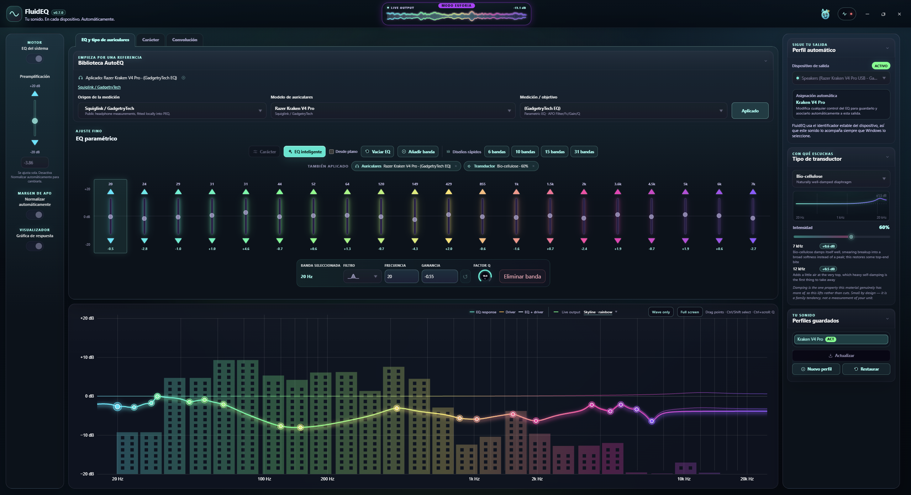
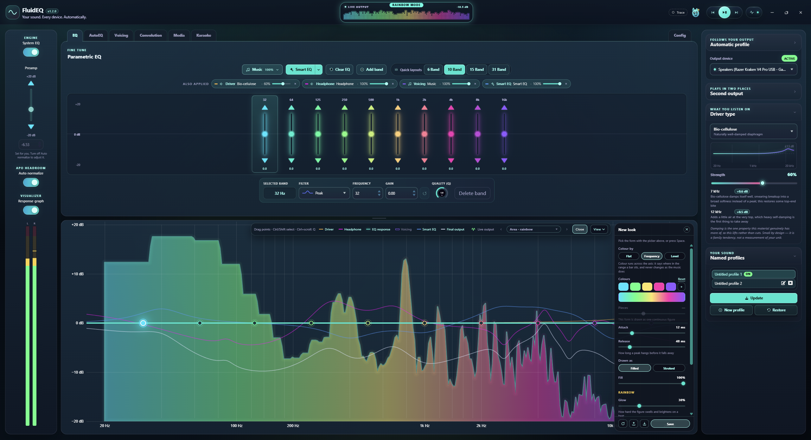

# FluidEQ

> Your sound. Every device. Automatically.

FluidEQ is a free, open-source system-wide parametric equalizer for Windows.
It puts a modern workflow on top of
[Equalizer APO](https://sourceforge.net/projects/equalizerapo/): tune once per
output, and the right sound follows the right device without you touching
anything again.



## What it does

**Follows your output.** Every setting below belongs to the device you tuned it
on. Plug in your headphones and their tuning comes back; switch to speakers and
theirs does. FluidEQ maps the stable Windows endpoint ID, not the display name,
so it survives renames and re-plugs.

**Four layers, one chain.** Each is written as its own stage in the Equalizer
APO config, in this order:

| Layer         | What it is                                                                                                                                                                                |
| ------------- | ----------------------------------------------------------------------------------------------------------------------------------------------------------------------------------------- |
| Convolution   | A measured impulse response applied before anything else — from the AutoEq catalogue or a WAV of your own.                                                                                |
| Parametric EQ | Up to 128 bands. Peak, low/high shelf, low/high pass, band pass and notch, each with frequency, gain and Q.                                                                               |
| Voicing       | Five curated target curves — music, movies, games, speech, late night — with a strength slider.                                                                                           |
| Driver type   | Twelve compensation profiles for what you are actually listening on: dynamic, planar, balanced armature, electrostatic, bone conduction, the common diaphragm materials, and driver size. |

Everything active is named on the EQ page, so a bump in the graph is never a
mystery — you can see what put it there and remove it in one click.

**Start from a measurement.** 6,028 headphone models and 8,850 responses ship
offline from the official AutoEq results. The GadgetryTech Squiglink database is
available online as a second source. Once applied, FluidEQ remembers which model
your bands came from and says so.

**Smart EQ.** Measures what is actually coming out of your output and flattens
what it hears, rather than assuming a target.

**One preamp, computed.** Every layer contributes to a single `Preamp:` line
derived from the real combined response, so adding a voicing or a convolution
cannot clip you — and removing one gives the headroom back.

**Import what you already have.** An Equalizer APO ParametricEQ or GraphicEQ
file, a FluidEQ profile, or any WAV impulse response.

**Ten languages.** English, 简体中文, हिन्दी, Español, Français, Português,
Русский, 日本語, Deutsch, Italiano — the most-spoken left-to-right scripts.
The installer offers a language too, preselecting your Windows one, and the app
does the same on first run. Change it any time from the actions menu. Every
label, hint, error and tooltip is translated, and a test fails the build if a
locale falls behind English. Right-to-left languages are deliberately absent:
the layout has never been mirrored, and a broken Arabic is worse than none.

**Updates itself.** FluidEQ checks GitHub for a new version, downloads it in
the background and offers to restart. Being offline is not an error and says
nothing. After updating, a **What's new** dialog shows what changed; it is in
the actions menu any time.

**Reopens where you left it.** Size, position and maximized state are
remembered. The position is only reused if a display still covers it, so
unplugging a second monitor cannot strand the window somewhere you cannot
reach it.

**Plays something to tune against.** A **Video** tab opens a small set of music
and video sites in a window inside the app, so a track can be playing while the
spectrum moves underneath it and a band is dragged. It is not a browser: it goes
to those sites and nowhere else, it downloads nothing, and its session is held
in memory and thrown away when the app closes, so nothing is ever signed in.

FluidEQ is not affiliated with, endorsed by, or connected to any of those sites.
They are opened as they are, in an ordinary Chromium window; the app neither
hosts, stores, copies nor redistributes anything from them. Whoever uses it is
responsible for keeping to each site's own terms of service.

**Local and account-free.** No cloud, no telemetry, no proprietary driver, no
virtual audio device.

## The config is the source of truth

FluidEQ used to keep its own copy of the state and write the Equalizer APO
config from it. That is backwards whenever anything else touches that config — a
hand edit, another tool, an APO reinstall, a restore from backup — because the
file is what you are hearing and the app's copy is only what it last believed.
On startup the file wins.

For everything it can express, at least, and that limit is the whole design.
Voicing and driver corrections reach APO as ordinary `Filter N:` lines with
nothing marking them as layers, so reading them back as truth would turn both
into hand-placed bands — the pickers would read "none" while the sound was
unchanged, and the next edit would write the layers in again on top of their own
flattened copies. So:

| Owned by the APO config                                           | Owned by the profile                                                             |
| ----------------------------------------------------------------- | -------------------------------------------------------------------------------- |
| Bands, preamp, GraphicEQ points, which impulse response is loaded | Which voicing, which driver profile, which headphone reference, the profile name |

Nothing in the second column is audible on its own. Everything in the first
column is.

## How device switching works

FluidEQ writes one `Device:` block per assigned output into its own config file,
which Equalizer APO includes. Because APO accumulates every block whose device
matches, the block for the output you are listening on is the one that applies.

```text
# Neutral fallback for every output without an attached profile.
Device: all
Channel: all

# Headphones -> Sony XM5 · Music
Device: {HEADPHONE-ENDPOINT-GUID}
Channel: all
Preamp: -6.4 dB
Convolution: fluideq-ir-8f2a1c9b4d70.wav
Filter 1: ON LSC Fc 105 Hz Gain 5.4 dB Q 0.7
Filter 2: ON PK Fc 2200 Hz Gain -3.1 dB Q 1.41
```

No virtual output device and no kernel driver.

## Getting started

FluidEQ is Windows-only, because Equalizer APO is the audio engine.

1. Download the installer from
   [Releases](https://github.com/StartSWest/FluidEQ/releases) and run it.
2. It carries Equalizer APO with it and offers to install it — nothing is
   downloaded and there is no second website to visit. APO's own setup opens so
   you can tick every output you want FluidEQ to manage; reboot when it asks.
   Already have Equalizer APO? It is left completely alone.
3. Pick your output at the top right, then tune.

That is the whole setup. Nothing needs saving — every edit attaches itself to
the current output automatically. Every output keeps at least one profile, and
you only need more if you want several tunings for the same device. Rename one
with the pencil on its row.

> The installer is not code-signed yet, so SmartScreen will warn on first run —
> and on each update, until there is a certificate. Choose
> **More info → Run anyway**, or build it yourself from source below.

## Known limitations

- **No code signing.** SmartScreen warns on install and on every update.
- **Windows only.** Equalizer APO is the audio engine and there is no
  equivalent to target elsewhere. On other platforms FluidEQ starts with two
  demonstration endpoints so the UI can be developed, and touches nothing.
- **Traditional Chinese readers get Simplified.** Locale matching uses the
  primary subtag, so `zh-TW` resolves to `zh`.
- **No right-to-left languages.** See above — the layout has not been mirrored.

## Where things live

| Path            | What is in it                                                                                                                   |
| --------------- | ------------------------------------------------------------------------------------------------------------------------------- |
| `src/common/`   | Pure logic, no Electron: filter maths, the APO text reader and writer, voicing and driver profiles, translations, validation.   |
| `src/main/`     | Electron main. `flush.ts` writes the APO config, `apoSync.ts` reads it back, `main.ts` owns the IPC surface and the live state. |
| `src/renderer/` | React. `FluidEqContext` holds the live EQ, `I18nContext` holds the language.                                                    |
| `CHANGELOG.md`  | The release notes, rendered inside the app.                                                                                     |
| `CLAUDE.md`     | The release procedure and the constraints that are not obvious from the code.                                                   |

## Supporting the work

FluidEQ is free and stays free. Nothing is behind a paywall, nothing is tracked,
and there is no paid tier waiting in the wings.

**This is one person's work — mine, Ivan Carmenates Garcia — built with a lot of love
and an unreasonable amount of attention to detail.** Every panel was drawn by
hand and argued over: how the response curve reads at a glance, the way a menu
unfolds, what a knob does when you drag it slowly, which words go on a button,
whether a chip should truncate its label or its value. Nothing here is a stock
component with a theme painted on top. The parts you are not supposed to notice
are the parts that took the longest.

If it earned a place in your setup, a contribution funds the time that keeps it
maintained and the next ideas out of the same workshop.

<a href="https://buymeacoffee.com/startswest"></a>

**[buymeacoffee.com/startswest](https://buymeacoffee.com/startswest)**

A one-off tip, no account needed. Click the link, or scan the code with your
phone.

Prefer to contribute time? Issues and pull requests are just as welcome — see
[CONTRIBUTING.md](CONTRIBUTING.md).

<br clear="left">

There is also a game hidden in that panel, for anyone who has contributed. Tap
the pet or press space on the beat of whatever you are playing — it reads the
real percussion out of your own audio, so it is your music you are playing
along to. Thirty-six consecutive perfect taps and the whole interface goes
rainbow with the sound:



## Development

### Requirements

- Windows 10 or 11
- [Node.js](https://nodejs.org/) 20+ and pnpm
- Visual Studio 2022 with **Desktop development with C++**
- Equalizer APO, for real system-audio integration

### Run it

```powershell
git clone https://github.com/StartSWest/FluidEQ.git
cd FluidEQ
pnpm install
pnpm dev
```

On non-Windows systems FluidEQ exposes two demonstration endpoints, so the UI
and the device-assignment flow can be worked on without touching system audio.

### Commands

```powershell
pnpm test:unit
pnpm lint
pnpm build
pnpm package
```

`pnpm package` produces two files in `release/build`: the NSIS installer and
`latest.yml`. **Both** must be attached to a GitHub release — `latest.yml` is
the manifest the updater fetches to compare versions, and a release without it
looks fine on GitHub while no user ever sees the update.

```powershell
gh release create vX.Y.Z --title "FluidEQ X.Y.Z" --notes-file notes.md "release/build/FluidEQ-Setup-X.Y.Z.exe" "release/build/latest.yml"
```

The version lives in both `package.json` and `release/app/package.json` and the
two must agree, or the artifact is named after the wrong one.

### Build-time configuration

Copy `.env.example` to `.env` to set the contribution links. Every value in it
is inlined into the renderer bundle and is therefore public by construction —
the file says so at the top, at length, because that is exactly the kind of
thing people get wrong once.

## What FluidEQ adds over AQUA

FluidEQ started as a fork of [AQUA](https://github.com/h39s/AQUA) and owes it
the foundation: an Electron/React equalizer, Equalizer APO integration, AutoEQ
support, filter controls, preset management and a response graph. Everything
below is new work, and it is most of what you interact with.

**Sound**

- **Automatic per-output profiles.** Tune once and the tuning attaches itself to
  the Windows endpoint you were listening on, by stable GUID rather than by
  display name. Switch outputs and the right sound follows, with no save step.
  This is the idea the whole app is built around.
- **Driver-type compensation.** Twelve profiles for what you are actually
  listening on — dynamic, planar magnetic, balanced armature, electrostatic,
  bone conduction, the common diaphragm materials, and driver size — each its
  own APO layer with a strength control and its own curve on the graph.
- **Voicing.** Five curated target curves, written after your bands so your own
  tuning is never overwritten and switching back restores it exactly.
- **Convolution.** Verified minimum-phase impulse responses from the AutoEq
  catalogue, or any WAV of your own, applied ahead of the parametric stage.
- **Smart EQ.** Measures what is actually coming out of your output and
  flattens what it hears, rather than assuming a target curve.
- **One computed preamp.** Every layer contributes to a single `Preamp:` line
  derived from the real combined response, so stacking a voicing on a
  convolution cannot clip you and removing one gives the headroom back.
- **The APO config as source of truth.** FluidEQ reads what is on disk on
  startup instead of trusting its own copy, so a hand edit or another tool
  wins rather than being silently overwritten.
- **Every APO filter type**, not just peak and shelf: low/high pass, band pass
  and notch, with the pass forms written without the `Gain` token APO rejects.
  Up to 128 bands.
- **Import** of Equalizer APO ParametricEQ and GraphicEQ files, FluidEQ
  profiles, and WAV impulse responses.
- **A second measurement source**, GadgetryTech via Squiglink, fitted into PEQ
  locally rather than bundled.

**Interface**

- A rebuilt UI: a shared design-token layer, a scrolling workspace that stops
  panels fighting over the window, a response graph with draggable points and a
  live output curve, and a motion vocabulary that respects
  `prefers-reduced-motion`.
- **Ten languages**, with a test that fails the build when one falls behind.
- **In-app updates** and a What's new dialog rendered from the changelog.
- Window position and size remembered, and no white flash on launch.
- A small animated companion in the titlebar, because the app should be
  pleasant to leave open.

FluidEQ keeps AQUA's Git history, the copyright notices in every source file
and the GPL licensing. It is not presented as an official continuation and is
not endorsed by the AQUA maintainers.

## Attribution

FluidEQ is a derivative work of [AQUA](https://github.com/h39s/AQUA),
copyright © 2023 AQUA Dev Team, used under the GPL.

AutoEq data and targets are credited to
[Jaakko Pasanen](https://github.com/jaakkopasanen/AutoEq) and
[Ian Walton](https://github.com/iwalton3/AutoEq). The bundled library is the
official AutoEq results snapshot at commit
`7ae0f56d53074872b028649617a22bbb4232feb7`; maintainers can refresh it with
`pnpm autoeq:update` and validate every generated filter with
`pnpm test:autoeq`.

The optional **GadgetryTech / Squiglink** source stays separate from the offline
library. FluidEQ reads their public `phone_book.json` and REW measurements on
demand and fits the selected response into PEQ filters locally. Nothing from it
is bundled or republished by the installer; it is cached in the user data
directory only, and the attribution link stays visible in the app.

**Equalizer APO** is a separate project by
[Jonas Thedering](https://sourceforge.net/projects/equalizerapo/), licensed
GPL-2.0-or-later and therefore compatible with FluidEQ's GPL-3.0. FluidEQ does
not link any of its code — it writes the configuration file that APO reads —
but the FluidEQ installer **bundles APO's own installer** and offers to run it,
so that getting started never means going off to find a download.

Because that means redistributing APO's binary, every FluidEQ release also
publishes the matching **`EqualizerAPO-src-<version>.zip`** as a release asset,
which is how the GPL's source requirement is met. It is deliberately hosted
alongside the installer rather than linked elsewhere. APO's licence text ships
in `resources/licenses/EqualizerAPO-LICENSE.txt`, its installer is bundled
unmodified, and the version is pinned and checksum-verified in
[`.erb/scripts/fetch-equalizer-apo.ts`](.erb/scripts/fetch-equalizer-apo.ts).
If you bump that version, publish the matching source archive with it.

**FluidEQ is not affiliated with or endorsed by Equalizer APO or Jonas
Thedering.** It is an independent front end that happens to write the
configuration file APO reads. If something goes wrong in FluidEQ, please
[open an issue here](https://github.com/StartSWest/FluidEQ/issues) rather than
on the Equalizer APO tracker — a bug in this app is not his to answer for, and
his time is better spent on the engine all of us depend on.

FluidEQ is not affiliated with or endorsed by Dolby Laboratories.

See [NOTICE.md](NOTICE.md) for the full derivative-work notice.

## License

FluidEQ is free software under the
[GNU General Public License v3.0 or later](LICENSE), matching upstream AQUA.

Copyright © 2023 AQUA Dev Team<br>
FluidEQ modifications copyright © 2026 Ivan Carmenates Garcia

You may use, study, modify and redistribute this software under the GPL. A
distributed modified version must also make its corresponding source available
under the same license. This summary is not a substitute for the license text.
