# FluidEQ · User guide

> Find your sound. Make yourself at home.

A practical guide to FluidEQ, illustrated with real app captures. Start with your first listening session, then explore each workspace at your own pace.

Real FluidEQ captures from version 1.6.x. Colours, labels and control positions may differ in your version. Example settings are illustrations, not recommended presets.

**In FluidEQ: Help → User guide, or press F1.**

[Open the illustrated, print-ready edition](user-guide.html)

1. [Your first five minutes](#start)
2. [Shape your sound with EQ](#eq)
3. [Headphone correction & imports](#headphones)
4. [Use an impulse response](#convolution)
5. [Devices, profiles & second output](#profiles)
6. [Inspect & back up a chain](#config)
7. [Listen with Online Media](#online)
8. [Share audio between computers](#share)
9. [Build your local library](#library)
10. [Albums & your play queue](#queue)
11. [Explore the DSP rack](#dsp)
12. [Denoise & source analysis](#denoise)
13. [Make the player your own](#visuals)
14. [Sing with Karaoke](#karaoke)
15. [Create in Karaoke Maker](#maker)
16. [When something sounds wrong](#trouble)

## Your first five minutes

Start with a familiar song and a comfortable volume. The left rail controls system EQ and headroom; the centre holds your workspace; the right rail follows your output and its profiles. Playback controls stay at the bottom.

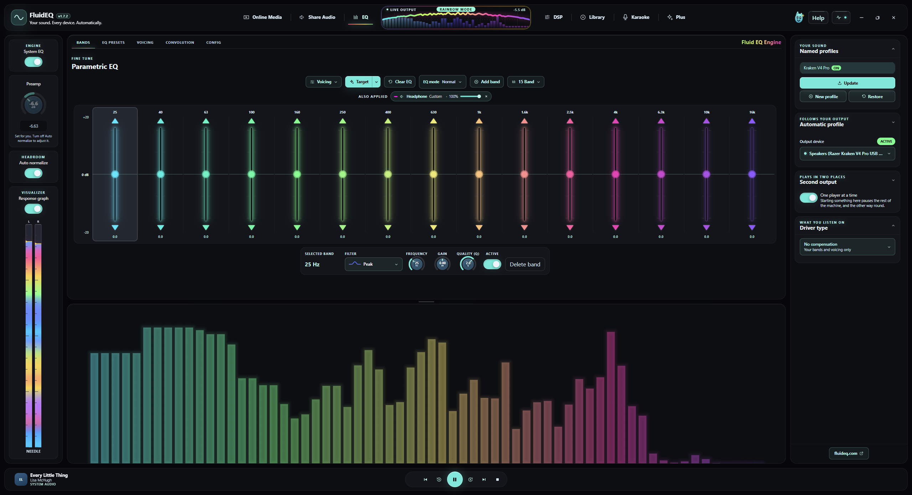

### Try it

1. On Windows, install Equalizer APO when the FluidEQ installer offers it, select the listening device in its Device Selector, and restart when requested.
2. Choose that device under Output device. Turn on System EQ and leave Auto normalize enabled.
3. Play a song, open EQ → Bands, make a small change, and compare with System EQ off and on.

> **Good to know:** System-wide EQ requires Windows and Equalizer APO. The macOS and Linux interfaces use demonstration endpoints; do not treat a moving graph there as proof of system-wide processing.

## Shape your sound with EQ

Frequency chooses where a band acts, Gain sets the boost or cut, and Q sets its width: higher Q is narrower. Low frequencies affect bass, the middle carries much of a voice, and the high end adds brightness. Begin with small changes.

### Try it

1. Select a band in EQ → Bands. Adjust Frequency, Gain and Quality (Q), or drag its point on the response graph.
2. Use a broad, gentle band for tonal balance. Compare before adding another. The filter selector changes the shape, including peak and shelves.
3. Use the layer switches and strengths to compare headphone correction, EQ, voicing and Smart EQ separately. Leave Auto normalize on while adding boosts.

> **Good to know:** The response curve describes your filters; the moving spectrum describes the signal being measured. Smart EQ needs audible material to measure. Detail, Balance and Target make different kinds of correction; begin by comparing one mode at a time.

## Headphone correction & imports

A headphone correction compensates for a measured model. It is a starting point you can combine with your own bands and voicing. Check the exact model and the measurement author before applying a result.

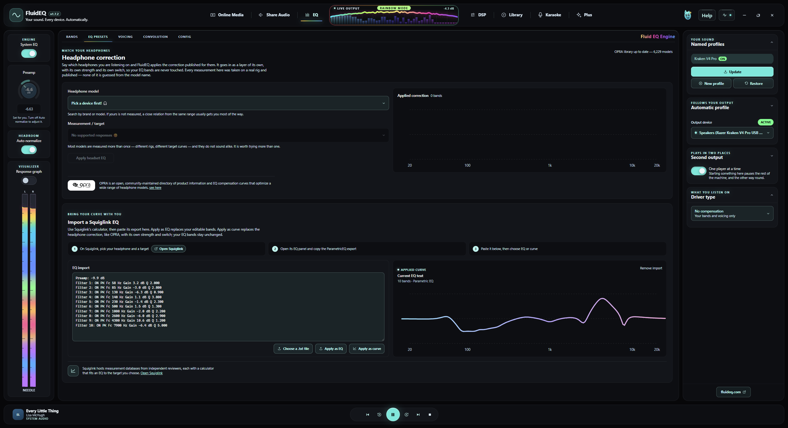

### Try it

1. Open EQ → EQ presets and search for your headphone model. Review the available measurements and choose the matching entry.
2. For EQ text from another tool, use Import EQ settings in Audio actions. Review the parsed bands and curve before applying.
3. For Squiglink, export the EQ text there, paste it into the import panel, and press Apply imported EQ when the preview is right.

> **Good to know:** A preview marked not applied is not changing your sound. Avoid stacking two full corrections for the same headphones unless that is deliberate; compare with the headphone layer switched off.

## Use an impulse response

Convolution applies a WAV impulse response as another correction layer. FluidEQ includes a searchable AutoEq catalogue and can import your own WAV. It remains separate from the editable parametric bands.

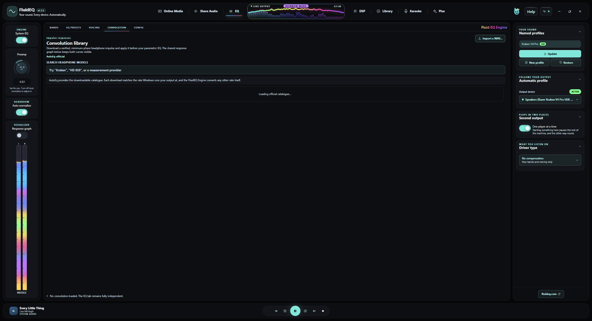

### Try it

1. Open EQ → Convolution. Search by model or measurement author.
2. Check the source and sample rate, then use Download and apply; use Import a WAV for a file you already have.
3. Listen with the convolution layer enabled and disabled. Adjust its strength before changing other layers.

> **Good to know:** The impulse sample rate must match the output for Equalizer APO. Catalogue downloads need an internet connection; the guide itself does not.

## Devices, profiles & second output

Your EQ follows the output device. Automatic mapping saves edits to the current endpoint, while Named profiles lets you keep alternative sounds. Second output mirrors playback to other devices with a separate level for each.

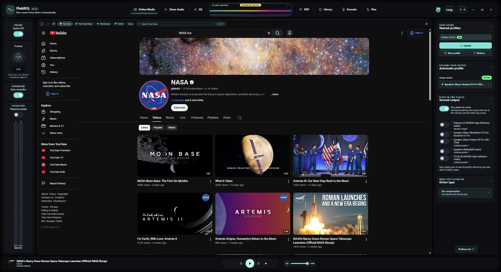

### Try it

1. Confirm Output device before editing. Use New profile for a sound you want to keep; Update saves changes to that named profile, and Restore brings its saved settings back.
2. Open Second output, enable a reachable device, and set its level. In current versions, choose that device’s saved EQ profile directly beneath it.
3. Use Game/Video for a smaller starting buffer or Music for more reserve. Compare synchronization on your devices.

> **Good to know:** Each mirrored Windows output uses its own APO profile. Mirroring runs while FluidEQ is open; switching the main output stops the old mirrors. Device latency still affects synchronization.

## Inspect & back up a chain

EQ → Config shows what Equalizer APO actually has on disk. The output cards and include tree help you see which device and layers are involved. Export a chain before a large experiment or when moving a setup.

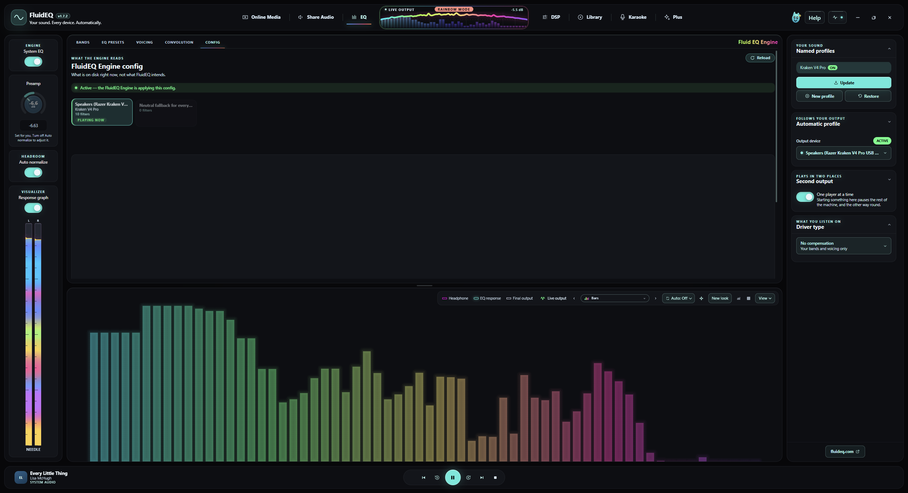

### Try it

1. Open EQ → Config and choose the output you want to inspect. Read its status and active layers.
2. Use Export chain to save a .fluideq file. Keep a copy somewhere you can find again.
3. To bring a chain back, select the intended output first, then use Import chain and review the result.

> **Good to know:** Generated layer files are rewritten when their settings change. For manual APO commands, use the per-output custom file that FluidEQ leaves alone; do not put lasting edits in generated layers.

## Listen with Online Media

Online Media keeps supported sites beside your EQ. Site playback and sign-in still depend on the provider and your connection. The transport at the foot of FluidEQ follows the active player.

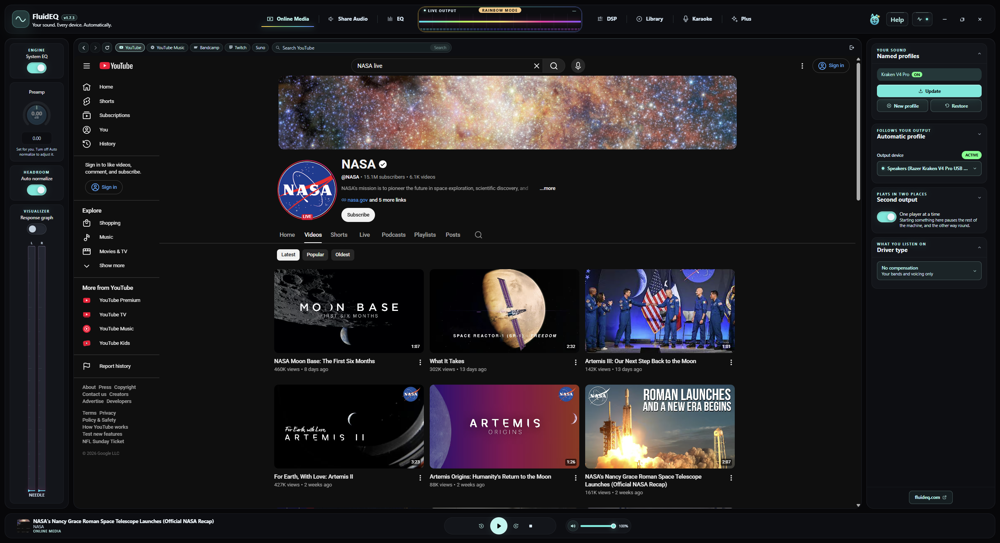

### Try it

1. Open Online Media and choose a supported site. Find and start something on that page.
2. Switch to EQ to tune while listening, then return to the page when you need its own controls.
3. Use One player at a time if you want FluidEQ and other players to pause one another instead of overlapping.

> **Good to know:** The DSP rack processes Library audio tracks, not Online Media. On Windows, system EQ can still affect the selected APO-enabled output.

## Share audio between computers

Share Audio sends system audio between computers on the same private network. The receiver is the computer connected to your headphones or speakers; other computers are senders. This is separate from mirroring to a second device on one computer.

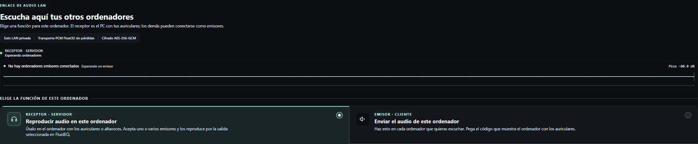

### Try it

1. On the listening computer, open Share Audio, choose Play audio on this computer and create a connection code. Start at a low volume.
2. On each source computer, choose Send audio from this computer, paste the receiver’s code, and connect. Keep FluidEQ open on both computers.
3. Check the connection monitor. Stop sending or listening when finished. If connection fails, check the shared private network and firewall permission.

> **Good to know:** Keep the connection code private: it authorizes pairing. Several senders can mix together and raise the level. Received shared audio bypasses the Library DSP rack.

## Build your local library

Library brings together music and video from your drives. Browse by albums, artists, songs, folders or videos. Album art and metadata come from your files, so the same collection may look different depending on its tags.

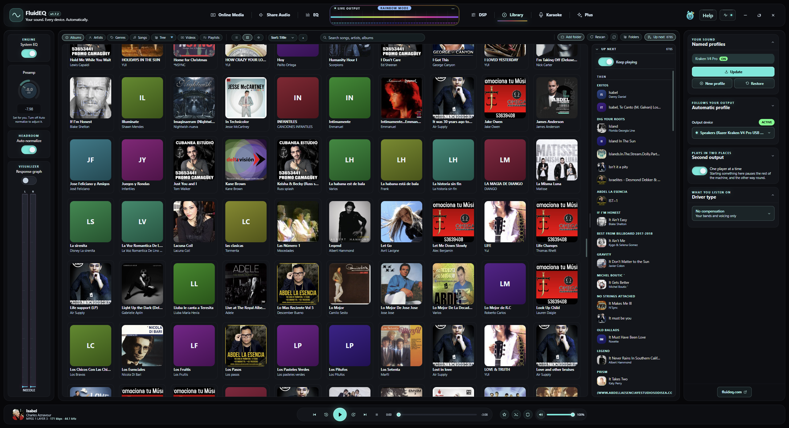

### Try it

1. Open Library and add the folder containing your media. Let indexing finish before judging what is missing.
2. Choose an artist or album, or search for a song. Start a track from the results.
3. Use the bottom transport to pause, seek, skip and adjust playback volume while you work in another tab.

> **Good to know:** Library needs access to the original files. If a drive is disconnected or a folder moves, reconnect it or add the new location.

## Albums & your play queue

The queue is the listening order; browsing is where you choose music. Opening another album lets you explore without making it the current song. The active track and Up next help you keep your place.

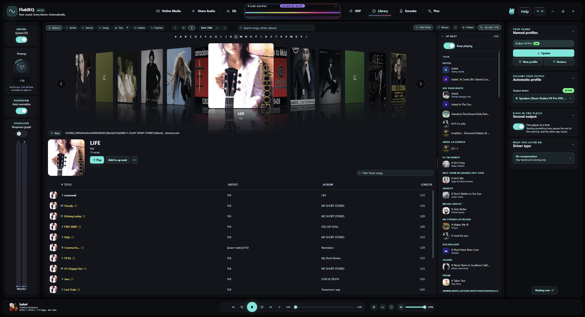

### Try it

1. Open an album to inspect its tracks. Start the one you want to hear.
2. Open the track menu for queue actions, such as playing next or adding to the queue.
3. Inspect Up next, then use shuffle or repeat when you want a different listening order.

> **Good to know:** Starting Library playback takes over from FluidEQ’s other players. Use the current track shown in the transport to confirm which source owns playback.

## Explore the DSP rack

DSP processes audio tracks played from Library only. Karaoke, videos, received shared audio and other apps bypass this rack. The rack includes Normalizer, Denoise, Exciter, Bass Forge, Equaliser, Bass Punch, Dimension, Maximizer and Master.

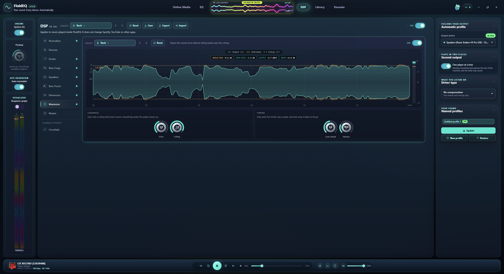

### Try it

1. Play an audio track from Library, open DSP, and enable the rack. Start with a preset or one stage.
2. Select a stage, change one control, and compare with that stage bypassed at a similar listening volume.
3. Watch output levels as you add processing. Save a rack you like; use Export and Import to exchange complete racks.

> **Good to know:** The DSP Equaliser and system EQ are separate stages and can both affect Library playback on Windows. Extra loudness can sound better simply because it is louder; compare at similar volumes.

## Denoise & source analysis

Denoise reduces unwanted noise in Library audio. Source analysis and its graph help you judge what the stage is responding to. Stronger reduction is not automatically better: listen for softened detail and watery or pumping textures.

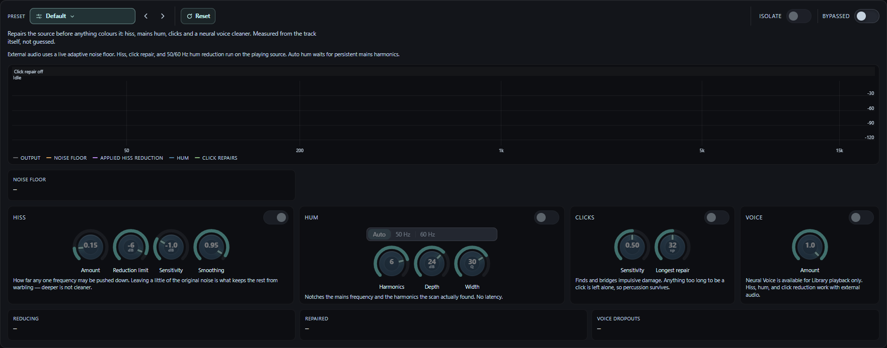

### Try it

1. Play a Library audio track with the noise you want to reduce and select Denoise in DSP.
2. Begin with a light setting, enable the stage, and listen to both quiet passages and musical detail.
3. Increase reduction gradually, then bypass the stage to check whether the improvement is worth any loss of detail.

> **Good to know:** This is not a microphone cleanup switch and does not process the Online Media player. If you hear no change, first confirm the source is a Library audio track and both rack and stage are enabled.

## Make the player your own

The response graph, live spectrum and level meter show different aspects of your sound. The visualizer offers multiple forms, palettes and peak looks. Appearance changes are independent of EQ settings.

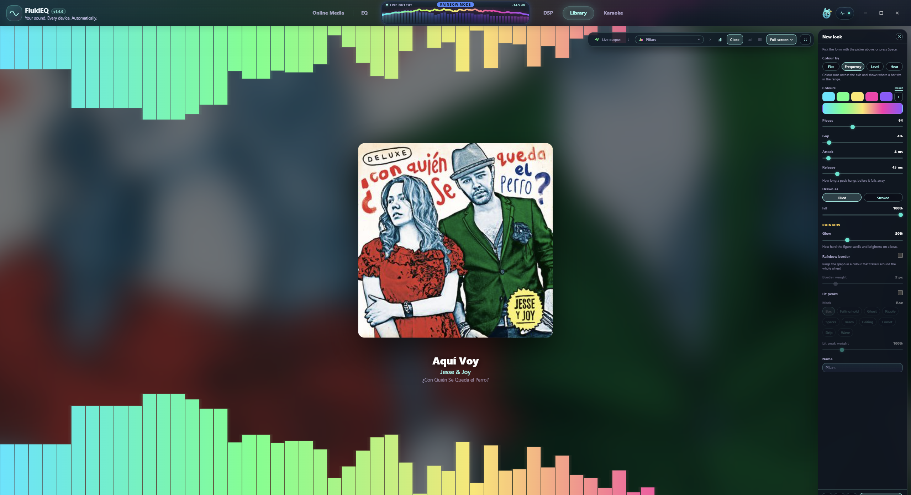

### Try it

1. Turn on Response graph in the left rail. Use View on the graph to choose its size.
2. Pick a visualizer form, then open New look to adjust colour, fill, glow, spacing and peaks. Save the look with a name.
3. For the whole interface, open Audio actions and choose a theme or language. Use Ctrl + plus, minus or 0 to enlarge, shrink or reset UI zoom.

> **Good to know:** A spectrum moving on screen is not proof that an EQ change reached your device. Compare what you hear and check the output status when diagnosing audio.

## Sing with Karaoke

Karaoke pairs your own audio with lyrics. Timed lyrics follow playback; pitch targets depend on the song’s note data. A microphone adds your live pitch when configured, and the stage can fill the screen.

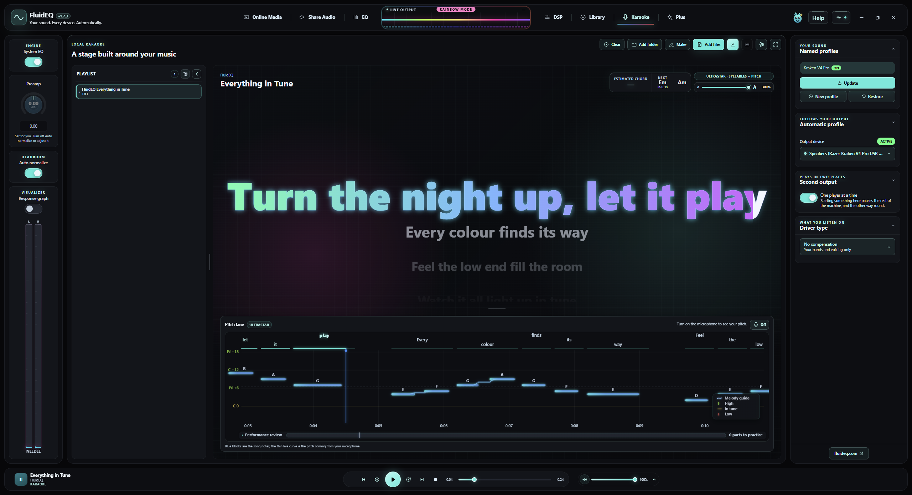

### Try it

1. Open Karaoke. Use Add files or Add folder to bring in audio and matching lyric files.
2. Choose a song and start playback. Check that the correct lyrics and backing track are paired.
3. Configure microphone input for live pitch, adjust lyric size for your viewing distance, and use the stage’s fullscreen control to sing.

> **Good to know:** A lyric-only file does not contain target notes. Missing pitch targets can mean the song has no note data; it does not by itself mean your microphone has failed.

## Create in Karaoke Maker

Maker turns your audio into an editable karaoke project. Its timeline brings together audio, lyrics and pitch notes. Automatic results are a starting point: check words, timing and notes against the recording.

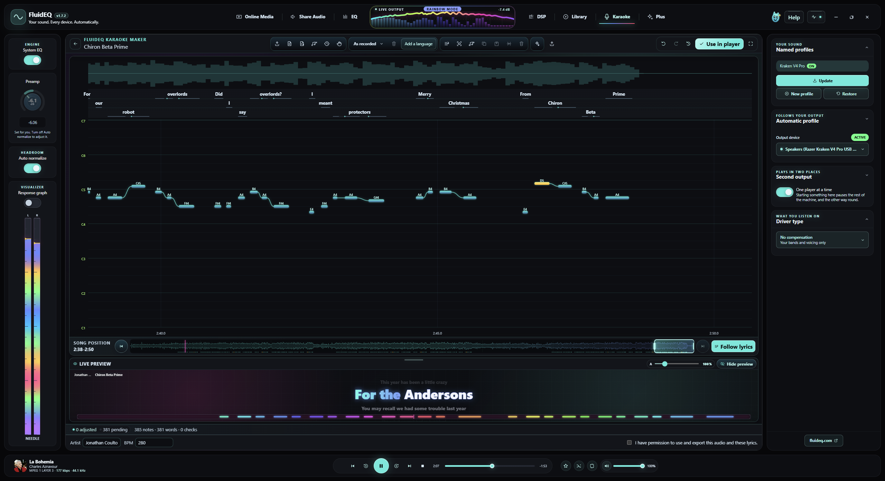

### Try it

1. Open Make from Karaoke and load the source audio. Choose the available separation or transcription tools you need.
2. Watch progress; first use of an AI tool may require a model download. Review the resulting lyrics and notes in the timeline.
3. Play short passages, correct the timing and text, save the project for later editing, then export the karaoke files.

> **Good to know:** Model downloads need a connection and free disk space. Processing time depends on your hardware and song length. Use audio you are permitted to work with and review exports before sharing.

## When something sounds wrong

Start with the source and output, then isolate the layer. A graph, a saved preset or an enabled switch alone cannot prove that sound reached the intended device. The Help menu also leads to audio troubleshooting and problem reporting.

### Try it

1. No sound: confirm playback is running, the expected output is selected, volume is up, and the device is connected. Check whether One player at a time paused another source.
2. No EQ change: confirm System EQ is enabled and the Windows endpoint is selected in Equalizer APO. Use Fix audio problems for the guided repair sequence; restarts interrupt audio.
3. Distortion or excessive bass: leave Auto normalize on, reduce boosts and bypass layers one at a time. If it persists, use Report a problem and review the report before sending.

> **Good to know:** F1 opens this guide. Escape closes an enlarged capture, then the guide. If the interface is too large, Ctrl + 0 resets zoom. For DSP problems, first test a Library audio track rather than video or another player.
