# FluidEQ · User guide

> Find your sound. Make yourself at home.

A practical guide to FluidEQ, illustrated with real app captures. Start with your first listening session, then explore each part of the app at your own pace.

Real FluidEQ captures from versions 1.6 and 1.7. Colours, labels and control positions may differ in your version. Example settings are illustrations, not recommended presets.

**In FluidEQ: Help → User guide, or press F1.**

[Open the illustrated, print-ready edition](user-guide.html)

**Get started**

1. [Your first five minutes](#start)
2. [What your PC needs](#requirements)
3. [The FluidEQ Engine](#engine)

**Shape your sound**

4. [Shape your sound with EQ](#eq)
5. [EQ mode and band designs](#eqmode)
6. [Headphone correction & imports](#headphones)
7. [Use an impulse response](#convolution)
8. [Devices, profiles & second output](#profiles)
9. [Inspect & back up a chain](#config)
10. [Explore the DSP rack](#dsp)
11. [The Room: surround on headphones](#room)
12. [Denoise & source analysis](#denoise)

**See your music**

13. [The graph and its controls](#graph)
14. [Styles and Plus visualizers](#looks)

**FluidEQ Plus**

15. [FluidEQ Plus and your account](#plus)
16. [The Visualizers gallery](#gallery)
17. [The Leaderboard](#leaderboard)
18. [Make scenes in the Studio](#studio)
19. [The desktop visualizer](#desktop)
20. [Dynamic lighting (beta)](#lighting)

**Listen, sing and share**

21. [Listen with Online Media](#online)
22. [Build your local library](#library)
23. [Albums & your play queue](#queue)
24. [Sing with Karaoke](#karaoke)
25. [Create in Karaoke Maker](#maker)
26. [Share audio between computers](#share)

**When you need help**

27. [When something sounds wrong](#trouble)
28. [Ask in the Forum](#forum)

## Your first five minutes

Start with a familiar song at a comfortable volume. The left rail switches FluidEQ on and holds the preamp; the centre is your workspace; the right rail follows your output and its profiles. The bar at the foot of the window controls whatever is playing.

### Try it

1. Install FluidEQ and keep the FluidEQ Engine selected when setup asks how to process your sound. Windows asks for permission once, with no restart.
2. Choose your listening device under Output device. Turn on System EQ and leave Auto normalize on.
3. Play a song, open EQ → Bands, make a small change, and compare with System EQ off and on.

> **Good to know:** System-wide EQ needs Windows and an audio engine: the FluidEQ Engine or Equalizer APO. On macOS and Linux the app shows demonstration outputs, so a moving graph there is not proof that anything is processed.

## What your PC needs

FluidEQ runs on any Windows PC of the last ten years. Two parts ask for more than the rest: the Plus visualizers draw on the graphics card, and the karaoke AI downloads its models the first time you use it.

### Try it

1. Check your Windows: Windows 10 version 1803 or later, or Windows 11, 64-bit, 4 GB of memory and about 600 MB of disk. Processing everything the PC plays needs the FluidEQ Engine or Equalizer APO, and Windows asks for permission once while it installs.
2. Look at a visualizer: any graphics card or built-in graphics from 2013 onwards. At 1080p built-in graphics are enough; 4K, or a desktop background on several screens at once, is happier with a dedicated card. On a busy card FluidEQ draws the scene smaller and lets go of the ones you cannot see.
3. Try the karaoke AI: separating a voice downloads a 713 MB model the first time, the pitch model adds about 180 MB, and noise removal 11 MB. With a DirectX 12 graphics card a four-minute song separates in around half a minute; on the processor alone it takes about four minutes. Keep 2 GB of memory free while it works.
4. Aim for this if you can: Windows 11, 8 GB of memory, graphics from 2018 onwards, and 3 GB of disk free if you use the AI features.

> **Good to know:** Everything but the AI models is in the installer, and those download only when you first use the feature. Processes, in the actions menu, shows what each part of FluidEQ is using on your machine right now.

## The FluidEQ Engine

FluidEQ processes your sound with its own engine or with Equalizer APO. The FluidEQ Engine runs inside Windows' audio service after your sound card's effects, brings your EQ and the DSP rack to everything the PC plays, and steps aside the moment FluidEQ closes.

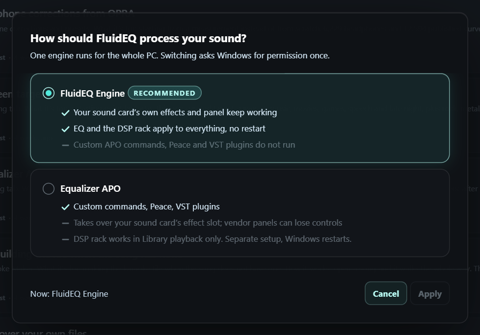

- **FluidEQ Engine** — Recommended. Your sound card's effects keep working, and the EQ and DSP rack reach every app.
- **Equalizer APO** — Runs custom APO commands, Peace and VST plugins. The DSP rack stays with Library playback.
- **Apply** — Switches the engine. Windows asks once, and audio restarts for a few seconds.

### Try it

1. Open the actions menu — the pulse button at the top right — and press the engine card at the top of it.
2. Choose FluidEQ Engine and press Apply. Windows asks for permission, and audio pauses for a few seconds while it restarts.
3. If an output shows OFF, press Enable on its notice. If a notice says the engine is not running, press Restart Windows audio.

> **Good to know:** Equalizer APO remains available for custom APO commands, Peace and VST plugins. When an update brings a newer engine, a notice offers Update engine. Quitting FluidEQ from the tray turns the EQ off on every output.

## Shape your sound with EQ

Frequency chooses where a band acts, Gain sets the boost or cut, and Q sets its width: higher Q is narrower. Begin with small, broad changes and compare often.

### The Bands page

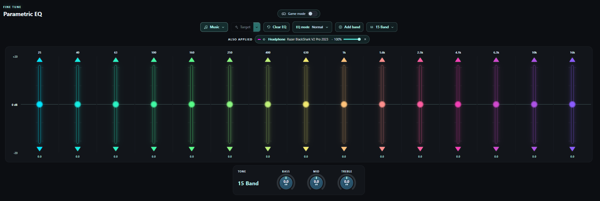

- **Presets** — A ready-made chain for the sound, such as Music or a genre. None leaves only your own bands.
- **Smart EQ** — Listens to what plays and corrects it: Detail, Balance or Target.
- **Clear EQ** — Sets every gain to 0 dB and keeps your bands. Asks first.
- **EQ mode** — How strongly your EQ and curves apply, band Q and phase.
- **Add band** — Adds a band beside the selected one.
- **Quick layouts** — Band counts, and the band designs you saved.
- **Frequency** — Where the selected band acts, from 1 Hz to 20 kHz.
- **Gain** — How much it boosts or cuts. Ctrl-click returns it to 0 dB.
- **Quality (Q)** — How wide it is: higher is narrower.
- **Delete band** — Press twice to delete the band; Keep changes your mind.

### A band's right-click menu

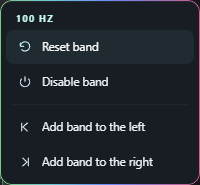

- **Reset band** — Gain back to 0 dB and Q back to 2.
- **Disable band** — Takes the band out of the sound and keeps its settings.
- **Add band to the left** — Adds a band halfway to its lower neighbour.
- **Add band to the right** — Adds a band halfway to its higher neighbour.

### Try it

1. Select a band in EQ → Bands. Turn its Frequency, Gain and Quality (Q) dials, or drag its point on the graph.
2. Right-click a band to reset it, switch it off, or add a band beside it. Ctrl-click a slider or dial to return it to its default.
3. Press Clear EQ to set every gain to 0 dB while keeping your bands. It asks first.

> **Good to know:** The response curve describes your filters; the moving spectrum describes the sound. Switching a band off with Active keeps its settings for later.

## EQ mode and band designs

EQ mode changes how your bands and your correction curves are applied, without editing them. Band designs keep the frequencies and Q of a layout you like, ready for any output.

### EQ mode

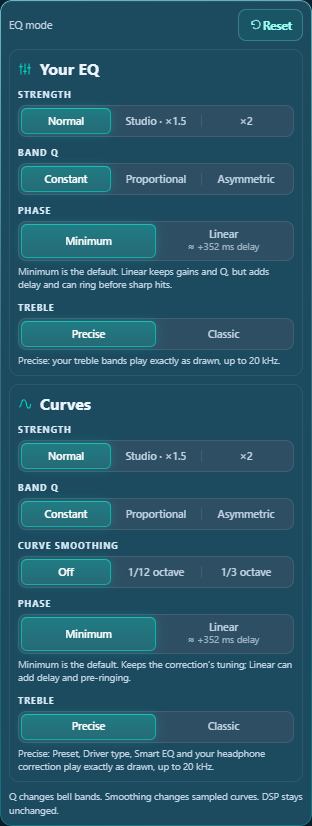

- **Strength** — Normal, Studio ×1.5 or ×2, for your EQ and your curves separately.
- **Band Q** — Constant keeps each Q; Proportional and Asymmetric narrow bands as they grow.
- **Curve smoothing** — Softens sampled correction curves.
- **Phase** — Minimum or Linear. With the FluidEQ Engine only.
- **Reset** — Everything back to Normal.

### Band designs

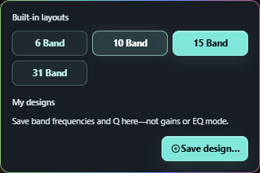

- **Built-in layouts** — Standard layouts of 6, 10, 15, 20 or 31 bands.
- **Save design…** — Names the current frequencies and Q as a design, listed under My designs.

### Try it

1. Open EQ mode on the Bands toolbar. Try a Strength, Band Q or Curve smoothing choice while music plays; the panel stays open.
2. Under the FluidEQ Engine, choose Minimum or Linear phase. Press Reset to return everything to Normal.
3. Open the layouts button beside Add band. Pick 6, 10, 15, 20 or 31 bands, or press Save design… to name the current layout.

> **Good to know:** A design stores only frequencies and Q: loading one starts every band at 0 dB. Linear phase adds delay and can ring before sharp hits.

## Headphone correction & imports

A headphone correction compensates for a measured model. It is a starting point you can combine with your own bands and voicing. Check the exact model and the measurement author before applying a result.

### Try it

1. Open EQ → EQ presets and search for your headphone model. Review the available measurements and choose the matching entry.
2. For EQ text from another tool, use Import EQ settings in the actions menu. Review the parsed bands and curve before applying.
3. For Squiglink, paste its export into the import panel. Apply as EQ replaces your bands; Apply as curve adds it as a headphone correction with its own strength.

> **Good to know:** A preview marked not applied is not changing your sound. Avoid stacking two full corrections for the same headphones unless that is deliberate; compare with the headphone layer switched off.

## Use an impulse response

Convolution applies a WAV impulse response as another correction layer. FluidEQ includes a searchable AutoEq catalogue and can import your own WAV. It remains separate from the editable parametric bands.

### Try it

1. Open EQ → Convolution. Search by model or measurement author.
2. Check the source, then use Download & apply; the download matches your output’s rate. Use Import a WAV for a file you already have.
3. Listen with the convolution layer on and off in Also applied.

> **Good to know:** The FluidEQ Engine converts any impulse rate itself. Equalizer APO needs an imported WAV at the output’s own rate. Catalogue downloads need a connection; the guide does not.

## Devices, profiles & second output

Your EQ follows the output device. Automatic mapping saves edits to the current output, while Named profiles lets you keep alternative sounds. Second output mirrors playback to other devices with a separate level for each.

### Try it

1. Confirm Output device before editing. Use New profile for a sound you want to keep; Update saves changes to that named profile, and Restore brings its saved settings back.
2. Open Second output, enable a reachable device, and set its level. Choose that device’s saved EQ profile directly beneath it.
3. Use Game/Video for a smaller starting buffer or Music for more reserve. Compare synchronization on your devices.

> **Good to know:** Each mirrored output uses its own profile under either engine. Mirroring runs while FluidEQ is open; switching the main output stops the old mirrors. Device latency still affects synchronization.

## Inspect & back up a chain

EQ → Config shows what the audio engine actually has on disk. The output cards and include tree help you see which device and layers are involved. Export a chain before a large experiment or when moving a setup.

### Try it

1. Open EQ → Config and choose the output you want to inspect. Read its status and active layers.
2. Use Export chain to save a .fluideq file. Keep a copy somewhere you can find again.
3. To bring a chain back, select the intended output first, then use Import chain and review the result.

> **Good to know:** Generated layer files are rewritten when their settings change; put lasting manual lines in the per-output custom file. The FluidEQ Engine reads its Filter, Preamp, GraphicEQ and Convolution lines; other APO commands and plugins need Equalizer APO.

## Explore the DSP rack

The DSP rack is a chain of studio stages. Under the FluidEQ Engine it processes everything the PC plays; under Equalizer APO it processes Library audio tracks. It is off while FluidEQ is switched off.

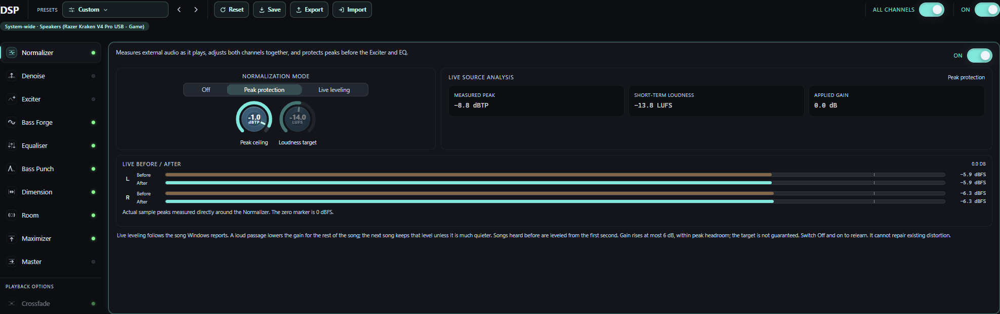

- **Normalizer** — Evens out loudness. On live audio it levels song by song.
- **Denoise** — Repairs hiss, hum and clicks. The neural voice cleaner works on Library tracks.
- **Exciter** — Adds harmonics for body and air.
- **Bass Forge** — Adds a real octave below the bass, or its harmonics for small speakers.
- **Equaliser** — Fifteen parametric bands, with minimum or linear phase.
- **Bass Punch** — Shapes the attack, sustain and bloom of the bass.
- **Dimension** — Widens the stereo picture without changing the mono sum.
- **Maximizer** — Raises the level without letting peaks pass the ceiling.
- **Master** — Final level, loudness target and peak safety.
- **Crossfade** — Blends one Library track into the next.
- **System-wide** — Where the rack is running, and any delay linear phase adds.
- **Presets** — Whole-rack chains for genres, devices and repairs.

### Try it

1. Open DSP. Pick a chain under Presets, or select a stage in the rail and switch it On.
2. Change one control at a time and compare with the stage bypassed at a similar volume. Isolate lets you hear only what a stage adds.
3. Save a rack you like, and use Export and Import to share it.

> **Good to know:** Louder often sounds better simply because it is louder, so compare at matched levels. Ctrl-click a dial to return it to its default.

## The Room: surround on headphones

The Room turns headphones into a listening room. Every channel of the sound becomes a speaker standing around your head, rendered through a measured head and the reflections of a room you shape yourself, so a film sits in front of you and a game surrounds you. It needs the FluidEQ Engine and headphones; on speakers it does nothing useful.

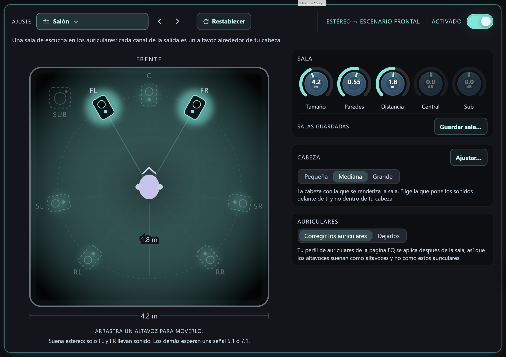

- **The room from above** — The room from above: walls that fade as they absorb, the speakers on their ring, the head in the middle. All of it is drawn to one scale, so a speaker standing further out than the room is wide is drawn outside its walls. Drag one and its pair moves with it; hold Shift to move it alone.
- **The chosen speaker** — Press a speaker in the room and this pane becomes its own: its angle as a number, its own distance, its level, and Mute or Solo to hear it alone.
- **Space, Ambience, Distance** — How much of the walls you hear, the soft tail after them, and how far the speakers stand. Size, Walls and the tail's own length and tone are in Room character below.
- **What the room is doing** — Read from the engine: which speakers the playing stream reaches, or why the room is idle.
- **Room preset** — The rooms to start from, grouped like every other stage's profiles; Custom once you shape one.
- **Start the listening test** — Five listening pairs that pick the head for your ears.
- **Head** — The measured head the room renders through: small, medium or large.
- **Save** — Name the room as it stands; it comes back with a press.

### Try it

1. Open DSP, choose Room in the rail and switch it on. Stereo becomes two speakers in front of you; a 5.1 film five and the sub; a 7.1 game the whole ring. The chip beside the switch says which.
2. Pick a room at the top — studio, living room, cinema, concert hall and more — or turn Size, Walls and Distance yourself and drag a speaker around the ring. Speakers the playing stream cannot reach are drawn asleep.
3. Press Start the listening test and answer five short listening pairs: the room takes the head that puts sounds in front of you. Small, Medium and Large can be chosen by hand too.
4. Save a room you like under a name; a saved room comes back with a press and never changes your head.

> **Good to know:** Games and films only send their surround channels to an output Windows believes has that many speakers: when the driver takes it, the output panel offers one press to 7.1.

## Denoise & source analysis

Denoise reduces hiss, mains hum and clicks. Under the FluidEQ Engine it works live on anything the PC plays; the neural voice cleaner and the scanned noise floor are for Library tracks. Stronger reduction is not automatically better.

### Try it

1. Play something with the noise you want to reduce and select Denoise in DSP.
2. Switch on Hiss, Hum or Clicks with a light setting, and listen to quiet passages and to musical detail.
3. Increase reduction gradually, then bypass the stage to check that the improvement is worth any loss of detail.

> **Good to know:** Listen for softened detail and watery or pumping textures. This is not a microphone cleanup. If you hear no change, confirm the rack and the stage are both on.

## The graph and its controls

The response graph draws your EQ curves over the live sound. The strip above it chooses what is drawn and how, and it changes with the look: a standard style or a Plus visualizer.

### With a standard style

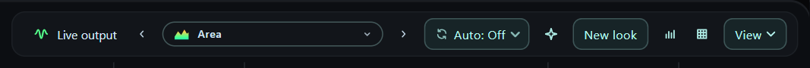

- **Live output** — Shows or hides the live wave.
- **Previous style** — Steps back to the previous look.
- **Styles and visualizers** — Opens every style and visualizer.
- **Next style** — Steps forward to the next look.
- **Auto** — Changes the look every 10 seconds to 2 minutes.
- **Colouring** — Colours the style: Auto, Flat, Frequency, Level or Heat.
- **New look** — Designs a look of your own from this style.
- **Listening bands** — Shades the bands you hear most.
- **Grid** — Shows or hides the grid and scales.
- **View** — Size, what is drawn, and the wave.

### With a Plus visualizer

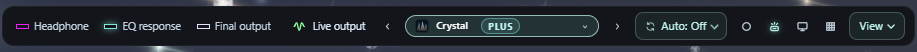

- **Window colours** — The app's theme, the visualizer's colours, or its colours with light (Ambient).
- **Dynamic lighting** — Lights your RGB devices with this scene.
- **Set as desktop background** — Puts this visualizer behind your desktop icons.

### The View menu

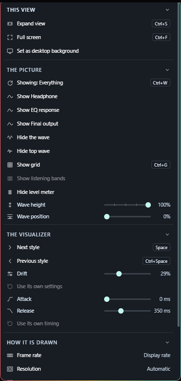

- **Expand view** (`Ctrl+S`) — The graph grows over the editor.
- **Full screen** (`Ctrl+F`) — The graph fills the screen.
- **Showing** (`Ctrl+W`) — Steps through what the graph shows.
- **The wave** — The live spectrum drawing.
- **Top wave** — The small wave in the title bar.
- **Grid** (`Ctrl+G`) — Shows or hides the grid and scales.
- **Listening bands** — The same shading; greyed over a Plus visualizer, which never draws it.
- **Level meter** — The output meter in the left rail.
- **Wave height** — How tall the wave is drawn.
- **Wave position** — From the bottom edge up to the middle.
- **Next style** (`Space`) — Steps forward to the next look.
- **Previous style** (`Ctrl+Space`) — Steps back to the previous look.
- **Attack** — How fast a Plus visualizer rises to the music.
- **Release** — How slowly it falls back after each hit.
- **Use its own timing** — Back to the timing the visualizer came with.
- **Set as desktop background** — Puts this visualizer behind your desktop icons.

### Try it

1. Click the look’s name to choose a style or visualizer. The arrows beside it, Space and Ctrl+Space step through them.
2. Open View for the graph’s size, what it shows, and the wave’s height and position. Frame rate is there too: every frame your display offers, or 60 or 30, held at 60 on battery.
3. A Plus visualizer adds its own controls to View — whatever its author left for you to set — and Restore puts the wave back to the height and position that author chose.
4. Double-click the plot for full screen. A single click hides or shows the strip.

> **Good to know:** Everything here changes only the drawing, never your sound. Esc leaves the expanded and full-screen views.

## Styles and Plus visualizers

Standard styles are free drawings of the live sound that you can colour and design yourself: Line and Area for a clean trace, LED blocks and Spikes for punch, Truss, Skyline and Dancing flames for whole scenes. Plus visualizers are scenes drawn on the graphics card, such as Alpine, Aurora, Bloom and Neon City, where the bass, the beat and the treble each move something different.

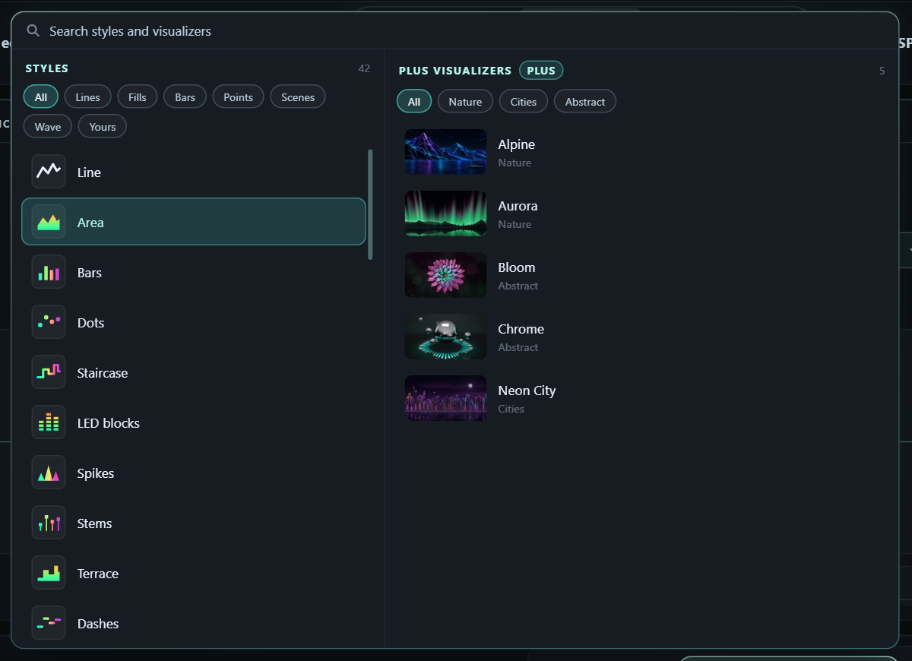

- **Search** — Finds styles and visualizers by name, maker or category.
- **Styles** — Free styles drawn by FluidEQ, and the looks you saved.
- **Style filters** — Lines, Fills, Bars, Points, Scenes and Yours.
- **Plus visualizers** — Scenes from FluidEQ and from members, each with a picture.
- **Categories** — Nature, Cities, Abstract and more.

### Try it

1. Click the look’s name on the graph. Search, or filter the styles by Lines, Fills, Bars, Points or Scenes.
2. Choose a Plus visualizer on the right. Without Plus it is locked, and choosing it explains how to get it.
3. On a standard style, press New look to change its colours, motion and peaks, then save it; it appears under Yours.

> **Good to know:** A Plus visualizer brings its own colours: set its attack and release in View. If a scene cannot run on this computer, the graph draws a free style instead of a blank plot.

## FluidEQ Plus and your account

An account is optional: everything that was free runs on this computer without one. FluidEQ Plus, monthly or yearly, adds Visualizers, the Leaderboard, the Studio, Dynamic lighting and the desktop visualizer. A new account can try Plus free for fifteen days, and a scene you publish that is approved earns you a month.

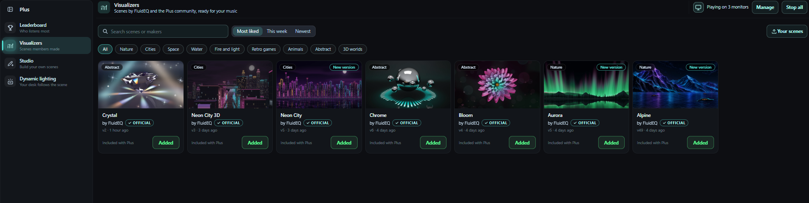

- **Leaderboard** — Who listens most, among Plus members who join.
- **Visualizers** — Scenes by FluidEQ and members, ready for your music.
- **Studio** — Make your own scenes with your AI.
- **Dynamic lighting** — Your RGB devices follow the scene.
- **Collapse the sidebar** — Folds the rail to its pictures; it opens again on hover.

### Try it

1. Open Account in the actions menu. Sign in, or create an account and type the six-digit code sent to your email.
2. Press Upgrade to Plus, read the terms, tick that you agree, and pay on Buy Me a Coffee in your browser with the same email.
3. Open the Plus tab. Its rail leads to the Leaderboard, Visualizers, the Studio and Dynamic lighting.

> **Good to know:** The app never sees your card; Manage subscription changes or cancels it. The free trial asks for no card and charges nothing when it ends. An account stays signed in on up to five computers, and Plus keeps working offline for a while.

## The Visualizers gallery

Visualizers holds FluidEQ’s own scenes and the ones members publish. Any account can browse and try FluidEQ’s free samples for ten seconds; Plus plays every scene on your music and adds it to your looks.

- **Search scenes or makers** — Finds scenes and makers.
- **Sort** — Most liked, liked this week, or newest.
- **Categories** — Shows one kind of scene.
- **A scene** — Its picture opens the scene; Add puts it in your looks.
- **Your scenes** — The scenes you published, with their likes.
- **Manage** — What each monitor shows as a desktop background.
- **Stop all** — Stops every desktop background.

### A scene's page

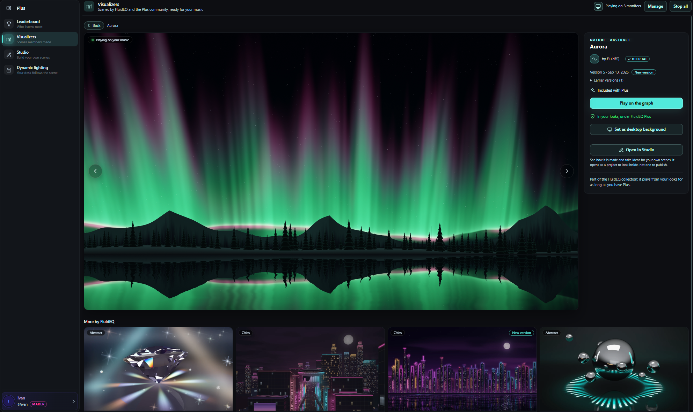

- **Play on the graph** — Adds the scene to your looks, or plays it on the graph.
- **Set as desktop background** — Puts the scene behind your desktop icons.
- **Open in Studio** — Opens FluidEQ’s scene in the Studio to see how it is made.
- **Back** — Back to the gallery, where you left it.

### Try it

1. Open Plus → Visualizers. Search, sort by Most liked, This week or Newest, or pick a category.
2. Open a scene, press Add to my looks, then Play on the graph. The arrows, or ← and →, step between scenes.
3. Like members’ scenes with the heart, and report one that should not be there.

> **Good to know:** Scenes in your looks update themselves, and a scene’s page says what changed in each version. A scene you publish appears once a moderator has approved it. Open in Studio shows how FluidEQ’s own scenes are made.

## The Leaderboard

The Leaderboard ranks the Plus members who join it, by how much they listen and by the likes their scenes earn. It is off unless you join.

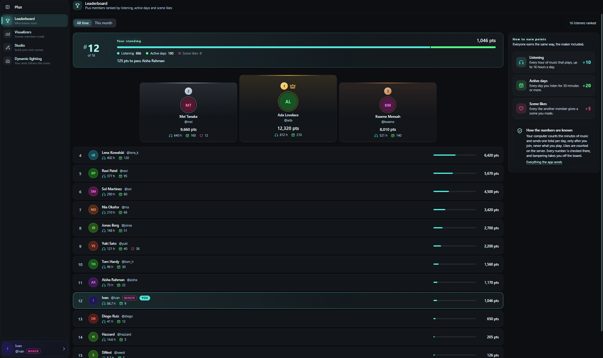

- **All time or This month** — The whole history, or this month only.
- **Your standing** — Your rank and points, and how far the next place is.
- **How to earn points** — 10 points an hour, 20 for each day of 30 minutes or more, 5 for each like.

### Try it

1. Open Account and press Join the leaderboard.
2. Open Plus → Leaderboard. Choose the handle and name the board shows, then switch between All time and This month.
3. To stop, press Leave the leaderboard. Remove all my data deletes everything you sent.

> **Good to know:** One number a day leaves your computer — the minutes of music that played — and never what you play. Every number is checked on the server. Your handle and name can be changed later from Account → Change name; the board and your published scenes follow.

## Make scenes in the Studio

The Studio turns a description into a visualizer. Your own AI assistant writes the scene in a project folder, and FluidEQ plays each version on your music the moment it is saved. The Studio is part of Plus; a new account can open it on the free trial.

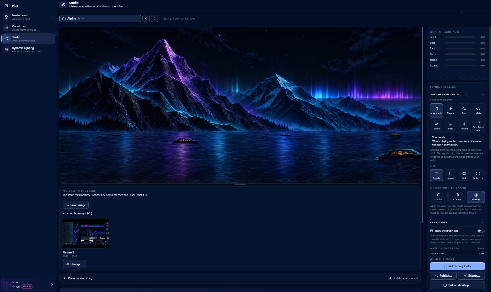

- **Project** — Your projects, and FluidEQ scenes to look inside.
- **Stage** — The scene, playing on your music. Double-click for full screen.
- **Code** — The scene’s code, live, updated as your AI saves it.
- **What it hears now** — What the scene receives: level, beat, bass, mids, treble.
- **Preview audio** — Test signals that drive only this preview.
- **Size** — Tries the scene on a graph, narrow, wide or full-screen panel.
- **Wave on the graph** — Tries the wave height and position listeners can set.

### Try it

1. Open Plus → Studio and press New project…. Give it a name; FluidEQ makes its folder with a scene that already moves.
2. Describe your idea, open the folder in your AI assistant, and paste the prompt from Copy AI prompt.
3. Watch the stage as files are saved and try the test signals. Then Add to my looks, Publish… or Export….

> **Good to know:** Double-click the stage for full screen. Look inside a FluidEQ scene… opens one of FluidEQ’s own scenes to learn from; it cannot be published. Scenes that flash hard or run too heavy are held back. A scene you publish is read by a moderator first, and one that is approved earns you a month of Plus.

## The desktop visualizer

The desktop visualizer puts a Plus visualizer behind your desktop icons, on one monitor or on each of them, for as long as FluidEQ runs.

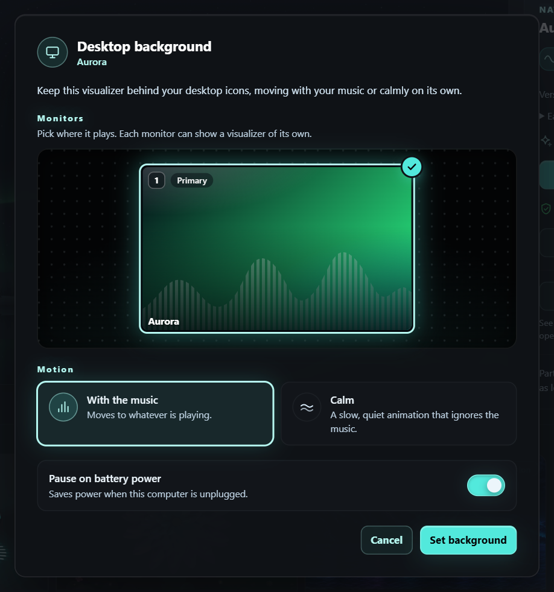

- **Monitors** — Your monitors as Windows arranges them. Press the ones to use.
- **With the music** — Moves to whatever is playing.
- **Calm** — A slow, quiet animation that ignores the music.
- **Pause on battery power** — Saves power while the computer is unplugged.
- **Set background** — Starts it on the monitors you chose.

### Try it

1. Put a Plus visualizer on the graph and press the monitor button beside its name, or choose View → Set as desktop background.
2. Press the monitors on the map, choose With the music or Calm, and press Set background.
3. To change or stop it, open Plus → Visualizers and use Manage or Stop at the top.

> **Good to know:** It pauses while windows cover the monitor, while the PC is locked and, if you choose, on battery power, and returns when FluidEQ starts. Quitting FluidEQ stops it. Windows only.

## Dynamic lighting (beta)

Dynamic lighting lights your keyboard, mouse, mousepad, headset and stand with the Plus visualizer on the graph, through Windows Dynamic Lighting and Razer Chroma. It is in beta, so tell us how your devices behave.

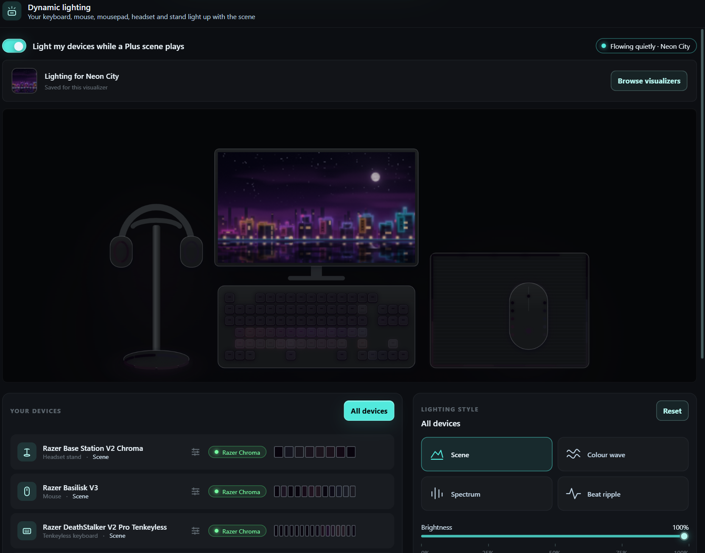

- **Light my devices while a Plus scene plays** — Lights your devices while a Plus visualizer plays.
- **Live desk preview** — Your own desk, lit with the colours sent to it.
- **Your devices** — Every device found. Click one to tune it alone.
- **Lighting style** — Scene, Colour wave, Spectrum or Beat ripple, kept for each visualizer.
- **Browse visualizers** — Opens the gallery to choose a visualizer.
- **All devices** — Back to tuning every device at once.

### Try it

1. Open Plus → Dynamic lighting and switch it on, or press the lighting button beside a Plus visualizer on the graph.
2. Choose this visualizer’s lighting style — Scene, Colour wave, Spectrum or Beat ripple — and set its brightness and what it responds to.
3. Click a device under Your devices to tune it alone; All devices goes back to every device.

> **Good to know:** If Windows keeps a device for another app, the page names the setting to change and opens it for you. Razer devices need Razer Synapse running, with Chroma Apps allowed.

## Listen with Online Media

Online Media keeps supported sites beside your EQ. Site playback and sign-in still depend on the provider and your connection. The bar at the foot of FluidEQ follows the active player, and its volume is the site’s own.

### Try it

1. Open Online Media and choose a supported site. Find and start something on that page.
2. Switch to EQ to tune while listening, then return to the page when you need its own controls.
3. Use One player at a time if you want FluidEQ and other players to pause one another instead of overlapping.

> **Good to know:** Under the FluidEQ Engine, Online Media goes through your EQ and the DSP rack like every other app. Under Equalizer APO the rack stays with Library tracks.

## Build your local library

Library brings together music and video from your drives. Browse by albums, artists, genres, songs, folders, a folder tree or your playlists. Album art and details come from your files, so the same collection may look different depending on its tags.

### Try it

1. Open Library and add the folder containing your media. Let the scan finish before judging what is missing.
2. Choose an artist or album, or search for a song. Start a track from the results.
3. Use the bar at the foot of the window to pause, seek and skip. Its volume is one level for every player.

> **Good to know:** Hover FluidEQ’s button on the Windows taskbar for Previous, Play and Next, even while it is minimized. Library needs the original files: reconnect a drive or add a moved folder again.

## Albums & your play queue

The queue is the listening order; browsing is where you choose music. Opening another album lets you explore without making it the current song. The active track and Up next help you keep your place.

### Try it

1. Open an album to inspect its tracks. Start the one you want to hear.
2. Right-click a song for Add to up next, Add to Favourites or Add to playlist.
3. Open Up next to see what plays after, and turn on Keep playing to continue with more of the same genre.

> **Good to know:** Starting Library playback takes over from FluidEQ’s other players. Use the current track shown in the bar to confirm which source owns playback.

## Sing with Karaoke

Karaoke pairs your own audio with lyrics. Timed lyrics follow playback; pitch targets depend on the song’s note data. A microphone adds your live pitch when configured, and the stage can fill the screen.

### Try it

1. Open Karaoke. Use Add files or Add folder to bring in audio and matching lyric files.
2. Choose a song and start playback. Check that the correct lyrics and backing track are paired.
3. Configure microphone input for live pitch, adjust lyric size for your viewing distance, and use the stage’s fullscreen control to sing.

> **Good to know:** A lyric-only file does not contain target notes. Karaoke follows the app’s Volume; the melody, backing and guide vocal levels are under Mix settings.

## Create in Karaoke Maker

Maker turns your audio into an editable karaoke project. Its timeline brings together audio, lyrics and pitch notes. Automatic results are a starting point: check words, timing and notes against the recording.

### The tools along the top of the maker

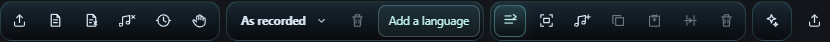

- **Import karaoke** — Opens a karaoke file or a saved project, and keeps the audio already loaded.
- **Lyrics** — The words and their timing, in one window.
- **Lyrics timing** — Moves the words and notes together, for a song that runs early or late from the first second.
- **Hand · pan timeline** — Drag anywhere on the timeline to travel through the song without changing anything.
- **Lyrics language** — Which language the words are in, and a second one beside it so the song can be sung in either.
- **Record line entries** — Play the song and press a key as each line starts and ends. The timing comes from your presses.
- **Select notes** — Draw a box around notes to move or delete them as one.
- **Paint notes** — Draw the melody straight onto the pitch grid.
- **Split** — Cuts a word into syllables, so a long word can carry a note on each one.
- **Repair tools** — The tools that listen for you, and the models they need.
- **Export** — Writes the finished karaoke out as a FluidEQ project, UltraStar TXT, LRC or enhanced LRC.

### The words, and when each one is sung

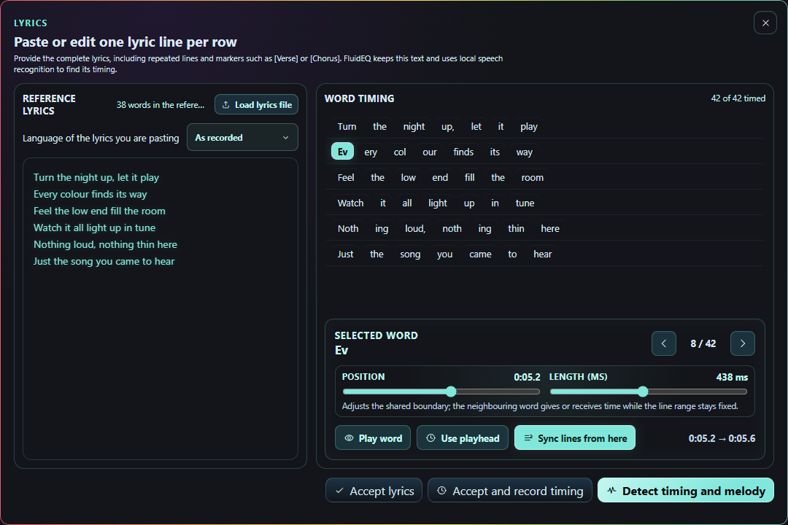

- **Reference lyrics** — The whole song as text, one line per row. Paste it or load a file; FluidEQ finds the timing from it.
- **Word timing** — Every word, in order, with how many are timed so far. Press one to work on it.
- **Selected word** — Where the chosen word starts and how long it lasts. Moving its edge gives or takes time from the word beside it; the line keeps its length.

### The AI tools, and the models they need

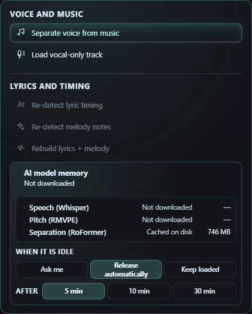

- **Separate voice from music** — Splits the recording into voice and music, so the karaoke can play without the singer.
- **Load vocal-only track** — Use a vocal-only file you already have, instead of separating one here.
- **Re-detect lyric timing** — Listens to the voice again and re-times the words you already have.
- **Re-detect melody notes** — Listens again for the melody and rewrites the notes under the words.
- **AI model memory** — What each model needs and whether it is on this computer. They are downloaded the first time you use one.
- **When it is idle** — Whether a model stays in memory between uses, and for how long. Releasing it frees memory; keeping it makes the next run start at once.

### Try it

1. Open Make from Karaoke and load the source audio. Choose the available separation or transcription tools you need.
2. Watch progress; first use of an AI tool may require a model download. Review the resulting lyrics and notes in the timeline.
3. Play short passages, correct the timing and text, save the project for later editing, then export the karaoke files.

> **Good to know:** Model downloads need a connection and free disk space. Processing time depends on your hardware and song length. Use audio you are permitted to work with and review exports before sharing.

## Share audio between computers

Share Audio sends system audio between computers on the same private network. The receiver is the computer connected to your headphones or speakers; other computers are senders. This is separate from mirroring to a second device on one computer.

### Try it

1. On the listening computer, open Share Audio, choose Play audio on this computer and press Create connection code. Start at a low volume.
2. On each source computer, choose Send audio from this computer, pick Music or Game/Video, paste the code for your network and press Connect and send.
3. Watch the connection monitor. Press Stop sending or Stop listening when finished; Create new code disconnects every saved pairing.

> **Good to know:** Keep the connection code private: it authorizes pairing. Several senders mix together and raise the level, and the receiver’s Volume sets it. Under the FluidEQ Engine, received audio also goes through the DSP rack.

## When something sounds wrong

Start with the source and output, then isolate the layer. A graph, a saved preset or an enabled switch alone cannot prove that sound reached the intended device. The Help menu also leads to audio troubleshooting, problem reporting and the Forum.

### Try it

1. No sound: confirm playback is running, the expected output is selected, volume is up, and the device is connected. Check whether One player at a time paused another source.
2. No EQ change: confirm System EQ is on and the output shows no OFF badge; press Enable if it does. If a notice says the engine is not running, press Restart Windows audio.
3. Everything looks right and the EQ still does nothing: Windows may be playing the music past the engine. The notice says so and offers one press to move the engine somewhere Windows will use; it costs a permission prompt and a second of silence.
4. Distortion or excessive bass: leave Auto normalize on, reduce boosts and bypass layers one at a time. If it persists, use Report a problem and review the report before sending.

> **Good to know:** F1 opens this guide. Esc closes an enlarged capture, then the guide. If the interface is too large, Ctrl + 0 resets zoom. Processes in the actions menu shows what each part of FluidEQ is doing.

## Ask in the Forum

The Forum brings FluidEQ’s GitHub Discussions into the app: announcements, ideas, questions and tunings people are proud of. Anyone can read; posting uses your GitHub account, not a FluidEQ one.

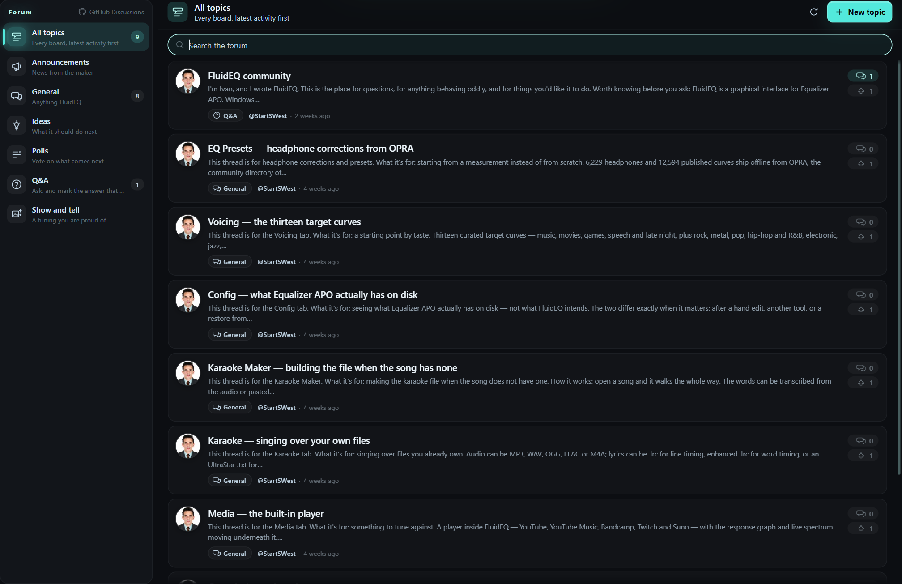

### Try it

1. Open Help → Forum and pick a board: Announcements, General, Ideas, Polls, Q&A or Show and tell.
2. Search the forum, or open a topic to read the replies.
3. Press Sign in with GitHub, finish in your browser, then post a New topic or a reply.

> **Good to know:** Everything posted is public on GitHub under your GitHub name. On Q&A, mark the answer that worked so the next person finds it.
